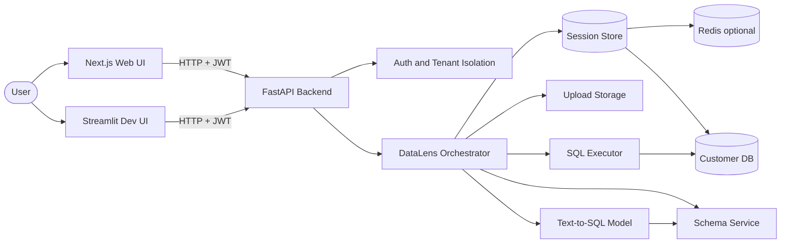

# DataLens

**Ask questions about your database in plain English. DataLens turns them into SQL, runs the query, and returns the results.**

DataLens is a Text-to-SQL system with a **FastAPI backend**, a **Next.js production web UI**, and an optional **Streamlit dev UI**. Connect SQLite (upload), Postgres, or MySQL, extract schema in [BIRD](https://bird-bench.github.io/) format, ask natural-language questions, and get executable SQL plus tabular results.

<p align="center">
  
  <br />
  <em>Add your banner image at <code>docs/images/hero-banner.png</code> — see <a href="docs/images/README.md">docs/images/README.md</a></em>
</p>

---

## Features

- **Natural language → SQL** — Local LLM ([Qwen2.5-Coder-7B](https://huggingface.co/Qwen/Qwen2.5-Coder-7B)) with BIRD-style prompts; optional 4-bit/8-bit quantization
- **Multi-database** — SQLite (upload), Postgres, and MySQL with encrypted credential storage
- **Schema extraction** — BIRD `dev_tables.json` format from SQLite, Postgres, or MySQL introspection
- **Safe execution** — sqlglot AST validation (SELECT-only), query timeouts, row caps
- **Authentication** — JWT login/signup and API keys; tenant-scoped sessions
- **Upload API** — `POST /upload` returns `file_id` for remote/multi-container deployment (no raw `db_path`)
- **Session persistence** — In-memory (dev) or Redis-backed sessions (`REDIS_ENABLED=true`)
- **Production UI** — Next.js app in [`web/`](web/)
- **Dev UI** — Streamlit in [`app/frontend/`](app/frontend/) for internal debugging
- **Observability** — Structured logging, Prometheus `/metrics`, audit log, Sentry hook, health probes
- **Training pipeline** — BIRD dataset tooling under `Training/BIRD_SQL/`
- **Schema RAG** — Retrieval module under `schema_retrieval/` (not yet wired to inference)

---

## Screenshots

### Connect to a database

Upload a `.sqlite` file or enter Postgres/MySQL credentials in the production web UI.

<p align="center">
  
</p>

### Chat with your data

Ask questions in plain English after the schema is extracted.

<p align="center">
  
</p>

### SQL + results

Every answer includes the generated SQL and a results table.

<p align="center">
  
</p>

> **Note:** Place your screenshots in `docs/images/` using the filenames above. See [docs/images/README.md](docs/images/README.md) for capture instructions.

---

## Architecture



### Request flow

1. **`POST /auth/signup`** or **`POST /auth/login`** — Obtain JWT (or use `X-API-Key`)
2. **`POST /upload`** — Upload SQLite file → receive `file_id` (SQLite only)
3. **`POST /connect`** — Open database, extract BIRD schema, return `session_id`
4. **`POST /query`** — Load schema → generate SQL → validate → execute → return rows
5. **`GET /schema/{session_id}`** — Return stored schema JSON
6. **`POST /disconnect`** — Close session and release resources

### Project structure

```
DataLens/
├── app/                          # FastAPI backend
│   ├── main.py                   # Entrypoint, middleware, health, metrics
│   ├── api/routes/               # auth, upload, connect, query, schema
│   ├── core/                     # config, auth, logging, metrics, rate_limit
│   ├── services/                 # datalens, db_connection, sql_executor, etc.
│   ├── models/                   # Pydantic request/response models
│   └── frontend/                 # Streamlit dev UI + api_client
├── web/                          # Next.js production frontend
├── tests/                        # pytest suite
├── Training/BIRD_SQL/            # Dataset building for model training
├── schema_retrieval/             # RAG-based schema retrieval (Qdrant + Neo4j)
├── Data/BIRD_SQL/                # BIRD benchmark databases (sample data)
├── docs/                         # Documentation and screenshot placeholders
├── docker-compose.yml            # Local full stack (API + Redis + web)
├── Dockerfile.api                # API container
└── .github/workflows/ci.yml      # Lint, test, Docker build
```

---

## Prerequisites

- **Python 3.11+** (3.13+ tested)
- **Node.js 20+** (for the Next.js frontend)
- **pip** and **venv**
- **Redis 7+** (optional; enable with `REDIS_ENABLED=true`)
- For **full model inference** (`DEBUG_MODE=false`):
  - GPU recommended (CUDA / Apple Silicon)
  - ~14 GB disk space for model weights
  - `torch` and `transformers` (in `app/requirements.txt`)

---

## Installation

```bash
git clone https://github.com/YOUR_USERNAME/DataLens.git
cd DataLens

python3 -m venv .venv
source .venv/bin/activate        # Windows: .venv\Scripts\activate

pip install -r app/requirements.txt
pip install -r app/requirements-dev.txt   # optional: pytest, ruff

# Next.js frontend
cd web && npm install && cd ..
```

### Environment variables

Copy the example file and edit as needed:

```bash
cp .env.example .env
```

Common local development settings:

```env
AUTH_REQUIRE_ENABLED=false
DEBUG_MODE=true
REDIS_ENABLED=false
```

See [`.env.example`](.env.example) for the full list (auth, Redis, upload limits, model quantization, CORS, Sentry, etc.).

| Variable | Default | Description |
|----------|---------|-------------|
| `AUTH_REQUIRE_ENABLED` | `true` | Set `false` for local dev without login |
| `DEBUG_MODE` | `false` | `true` = stub SQL, no GPU needed |
| `AUTH_SECRET_KEY` | `change-me-in-production` | JWT signing secret — **change in prod** |
| `REDIS_ENABLED` | `false` | Use Redis for session metadata |
| `MODEL_NAME` | `Qwen/Qwen2.5-Coder-7B` | Hugging Face model ID |
| `MODEL_QUANTIZATION` | `none` | `4bit`, `8bit`, or `none` |
| `MAX_QUERY_ROWS` | `100` | Max rows returned per query |
| `QUERY_TIMEOUT_SECONDS` | `30` | SQL execution timeout |
| `SESSION_TTL_SECONDS` | `3600` | Session expiry (seconds) |
| `CREDENTIAL_ENCRYPTION_KEY` | unset | Fernet key for Postgres/MySQL password storage |

---

## Running the app

### Option A — Docker Compose (recommended for full stack)

```bash
docker compose up --build
```

| Service | URL |
|---------|-----|
| API | http://localhost:8000 |
| Next.js web | http://localhost:3000 |
| Streamlit dev UI | http://localhost:8501 |
| Redis | localhost:6379 |

Compose defaults: `AUTH_REQUIRE_ENABLED=false`, `DEBUG_MODE=true`, `REDIS_ENABLED=true`.

### Option B — Local development (manual)

**Terminal 1 — API**

```bash
source .venv/bin/activate
AUTH_REQUIRE_ENABLED=false DEBUG_MODE=true uvicorn app.main:app --reload --port 8000
```

**Terminal 2 — Next.js (production UI)**

```bash
cd web
NEXT_PUBLIC_API_URL=http://127.0.0.1:8000 npm run dev
```

Open http://localhost:3000

**Terminal 3 — Streamlit (optional dev UI)**

```bash
source .venv/bin/activate
streamlit run app/frontend/streamlit_app.py
```

API docs: http://localhost:8000/docs (disable in production with `ENABLE_OPENAPI_DOCS=false`)

---

## Usage

### Next.js web UI (production)

1. Sign up or log in (or disable auth with `AUTH_REQUIRE_ENABLED=false`).
2. **Connect** via SQLite upload or Postgres/MySQL credentials.
3. Ask questions in the chat panel.
4. View generated SQL and results table.
5. Disconnect when finished.

See [`web/README.md`](web/README.md) for frontend-specific notes.

### Streamlit dev UI

Internal debugging only. Supports the same API flows (auth, upload, remote DB connect). See header in `app/frontend/streamlit_app.py`.

### API (curl)

**Sign up and log in:**

```bash
curl -X POST http://localhost:8000/auth/signup \
  -H "Content-Type: application/json" \
  -d '{"email":"user@example.com","password":"secret123","tenant_name":"acme"}'

curl -X POST http://localhost:8000/auth/login \
  -H "Content-Type: application/json" \
  -d '{"email":"user@example.com","password":"secret123"}'
# Save access_token from response
```

**Upload SQLite and connect:**

```bash
curl -X POST http://localhost:8000/upload \
  -H "Authorization: Bearer $TOKEN" \
  -F "file=@financial.sqlite"

curl -X POST http://localhost:8000/connect \
  -H "Authorization: Bearer $TOKEN" \
  -H "Content-Type: application/json" \
  -d '{"db_type":"sqlite","file_id":"FILE_ID_FROM_UPLOAD","db_id":"financial"}'
```

**Connect Postgres:**

```bash
curl -X POST http://localhost:8000/connect \
  -H "Authorization: Bearer $TOKEN" \
  -H "Content-Type: application/json" \
  -d '{
    "db_type": "postgres",
    "host": "localhost",
    "port": 5432,
    "database": "mydb",
    "username": "readonly",
    "password": "secret",
    "db_id": "mydb"
  }'
```

**Query:**

```bash
curl -X POST http://localhost:8000/query \
  -H "Authorization: Bearer $TOKEN" \
  -H "Content-Type: application/json" \
  -d '{"session_id":"YOUR_SESSION_ID","question":"How many clients are there?"}'
```

**Disconnect:**

```bash
curl -X POST http://localhost:8000/disconnect \
  -H "Authorization: Bearer $TOKEN" \
  -H "Content-Type: application/json" \
  -d '{"session_id":"YOUR_SESSION_ID"}'
```

> **Note:** Raw `db_path` in `/connect` is rejected. Upload the file via `/upload` and use `file_id`.

### Sample database

BIRD benchmark SQLite files, for example:

```
Data/BIRD_SQL/minidev/MINIDEV/dev_databases/financial/financial.sqlite
```

Upload this file via the web UI or `POST /upload`.

---

## API reference

| Method | Endpoint | Auth | Description |
|--------|----------|------|-------------|
| `GET` | `/health` | No | Status and version |
| `GET` | `/health/live` | No | Liveness probe |
| `GET` | `/health/ready` | No | Readiness (model, Redis) |
| `GET` | `/metrics` | No | Prometheus metrics |
| `POST` | `/auth/signup` | No | Create account |
| `POST` | `/auth/login` | No | Obtain JWT |
| `GET` | `/auth/me` | Yes | Current user |
| `POST` | `/upload` | Yes | Upload SQLite → `file_id` |
| `POST` | `/connect` | Yes | Connect DB, extract schema |
| `POST` | `/disconnect` | Yes | Close session |
| `POST` | `/connect/test` | Yes | Test Postgres/MySQL connection |
| `POST` | `/query` | Yes | NL question → SQL → results |
| `GET` | `/schema/{session_id}` | Yes | Stored BIRD schema JSON |

Auth: `Authorization: Bearer <token>` or `X-API-Key: dl_...`

<details>
<summary><strong>POST /connect</strong> — request body (SQLite)</summary>

```json
{
  "db_type": "sqlite",
  "file_id": "uuid-from-upload",
  "db_id": "optional_label"
}
```

</details>

<details>
<summary><strong>POST /connect</strong> — request body (Postgres/MySQL)</summary>

```json
{
  "db_type": "postgres",
  "host": "db.example.com",
  "port": 5432,
  "database": "analytics",
  "username": "readonly",
  "password": "secret",
  "db_id": "analytics"
}
```

</details>

<details>
<summary><strong>POST /query</strong> — response</summary>

```json
{
  "question": "How many clients are there?",
  "generated_sql": "SELECT COUNT(*) AS count FROM \"client\";",
  "columns": ["count"],
  "rows": [[5369]],
  "row_count": 1
}
```

</details>

---

## How it works

1. **Authenticate** — JWT or API key; every session is scoped to a tenant.
2. **Upload (SQLite)** — File stored under `data/uploads/{tenant_id}/`; opaque `file_id` returned.
3. **Connect** — `SessionStore` opens a read-only DB connection; remote credentials encrypted at rest.
4. **Extract schema** — Dialect-specific extractor produces BIRD JSON (tables, columns, types, PKs, FKs).
5. **Store schema** — In memory or Redis until session TTL expires.
6. **Query** — Schema rendered as text → LLM generates SQL → sqlglot validates SELECT-only → execute with timeout and row cap.
7. **Audit** — Connect, query, and disconnect events logged to `data/audit.db`.
8. **Respond** — JSON to API clients; chat + table in web UI.

---

## Training & schema retrieval

### `Training/BIRD_SQL/`

Tools for building Text-to-SQL training data from the [BIRD](https://bird-bench.github.io/) benchmark:

- `build_dataset.py` — Generate `{prompt, completion}` JSONL pairs
- `prompt_template.py` — BIRD-aligned prompt format (also used at inference)
- `schema_context.py` — Full, retrieved, or gold-union schema strategies

### `schema_retrieval/`

RAG pipeline for large databases where sending the full schema is impractical:

- Vector store (Qdrant) + graph store (Neo4j)
- `SchemaRAG` wrapper for ingest and retrieval
- See `schema_retrieval/wrapper.py` for usage
- **Not yet integrated** into the main query path

---

## Production deployment

DataLens includes production-oriented infrastructure:

- **Auth:** JWT + API keys; tenant-scoped sessions
- **Upload API:** `POST /upload` with `file_id` (no raw paths)
- **Multi-DB:** SQLite, Postgres, MySQL with encrypted credentials
- **Sessions:** Redis when `REDIS_ENABLED=true`
- **Safety:** sqlglot AST validation, query timeouts, row caps, audit logging
- **Observability:** structlog, Prometheus `/metrics`, Sentry, `/health/live` + `/health/ready`
- **Web UI:** Next.js in [`web/`](web/)
- **Docker:** `docker-compose.yml`, `Dockerfile.api`, `Dockerfile.inference`
- **CI:** `.github/workflows/ci.yml` (ruff + pytest + Docker build)

**Production checklist:**

```bash
cp .env.example .env
# Set: AUTH_SECRET_KEY, CREDENTIAL_ENCRYPTION_KEY, ENVIRONMENT=production
# Set: AUTH_REQUIRE_ENABLED=true, DEBUG_MODE=false, REDIS_ENABLED=true
# Set: ENABLE_OPENAPI_DOCS=false, CORS_ORIGINS=<your-domain>
```

Full implementation details: [`docs/DataLens_Production_Implementation_Documentation.docx`](docs/DataLens_Production_Implementation_Documentation.docx)

---

## Current limitations

- **DB connections with Redis** — Session metadata is shared, but live DB connections are process-local per API replica
- **Rate limiting** — SlowAPI middleware is wired; per-route limits not yet applied
- **Credential encryption** — Requires `CREDENTIAL_ENCRYPTION_KEY`; without it, credentials use weak base64 encoding
- **Synchronous `/query`** — 7B inference blocks the request; no async job queue yet
- **Prompt dialect** — System prompt mentions SQLite even for Postgres/MySQL sessions
- **Schema RAG** — `schema_retrieval/` not integrated at inference time
- **No export** — Query results cannot yet be exported as CSV/JSON
- **Model size** — Qwen2.5-Coder-7B requires significant RAM/GPU when `DEBUG_MODE=false`
- **Friendly column names** — Schemas use original column names (no BIRD description CSVs)

---

## Roadmap

- [x] Postgres and MySQL connection support
- [x] Persist sessions (Redis)
- [x] File upload API endpoint for remote deployment
- [x] Auth, audit logging, observability hooks
- [x] Production Next.js frontend
- [ ] Integrate `schema_retrieval/` for large schemas
- [ ] Fine-tuned model checkpoint
- [ ] Export query results (CSV / JSON)
- [ ] Async query job queue for inference under load

---

## Development

```bash
# Run tests
AUTH_REQUIRE_ENABLED=false DEBUG_MODE=true pytest tests/ -v

# Lint
ruff check app tests

# Run API with auto-reload
AUTH_REQUIRE_ENABLED=false DEBUG_MODE=true uvicorn app.main:app --reload --port 8000

# Run Next.js frontend
cd web && NEXT_PUBLIC_API_URL=http://127.0.0.1:8000 npm run dev

# Run Streamlit dev UI
streamlit run app/frontend/streamlit_app.py
```

---

## Acknowledgements

- [BIRD Benchmark](https://bird-bench.github.io/) for the Text-to-SQL datasets and schema format
- [Qwen2.5-Coder](https://huggingface.co/Qwen/Qwen2.5-Coder-7B) for SQL generation

---

## License

MIT — see [LICENSE](LICENSE).

---

## Contributing

Contributions are welcome. Please open an issue or pull request with a clear description of the change.

---

<p align="center">
  <sub>Built with FastAPI · Next.js · Hugging Face Transformers</sub>
</p>
