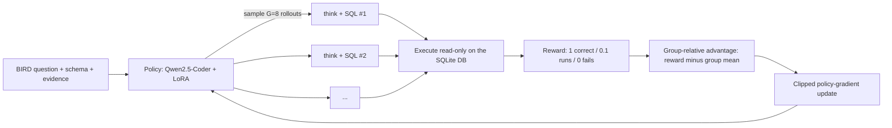

# Method: GRPO with an execution reward

DataLens follows the recipe of **Arctic-Text2SQL-R1** (Snowflake AI Research, 2025): take a strong
open coder model and improve it with reinforcement learning whose only reward is *whether the SQL it
writes returns the right answer*. No reward model, no human preference data, no hand-written
reasoning traces: the database is the judge.

## Why this method

The top of the BIRD leaderboard is dominated by systems built around large proprietary models:
CHASE-SQL, XiYan-SQL and similar pipelines generate many candidates with several prompting
strategies and then train a selector to pick one. They are strong, but they are mostly orchestration,
and they cost many large-model calls per question.

Arctic-Text2SQL-R1 showed that a much simpler route is competitive: GRPO on open Qwen2.5-Coder
models with a nearly binary execution reward, plus careful data filtering. It is the most
"ML" of the top methods, it is reproducible on one GPU at small scale, and it directly answers the
question this project asks: how far can a small model go when it is trained for the task?

## The training loop

For each question the policy samples a group of G completions. Each completion is a `<think>`
block followed by one SQL query, which is executed against the question's database.

**Reward**

| Outcome | Reward |
|---|---|
| Result set equals the gold result set (BIRD's EX criterion) | 1.0 |
| Query executes but returns something else | 0.1 |
| No parsable query, syntax error, unknown column, timeout | 0.0 |

The 0.1 gives an early gradient toward valid SQL; it is small enough that the policy cannot
profit from valid-but-wrong queries. A rollout that returns more than 100,000 rows (or twice the
gold result, if that is larger) is cut off and scored 0.1, so an accidental cross join early in
training cannot exhaust memory hours into a run.

**Advantage.** GRPO needs no value network: each completion's advantage is its reward minus the
mean reward of its group (scaled by the group's standard deviation). Questions where every rollout
gets the same reward contribute nothing, which is why the data filtering below matters.

**Objective.** We use TRL's `GRPOTrainer` with:

* `loss_type: dapo`: token-level normalisation so long completions aren't down-weighted;
* `epsilon_high: 0.28`: DAPO's asymmetric "clip-higher", which keeps low-probability tokens
  explorable and prevents entropy collapse;
* `beta: 0`: no KL penalty to a reference model (recent work finds it unnecessary for verifiable
  rewards, and it saves a model copy in GPU memory);
* `mask_truncated_completions: true`: completions cut off at the length limit are excluded from the
  loss instead of being punished as wrong.

**Efficiency.** Rollouts are generated by vLLM colocated on the training GPU; LoRA (r=32 on all
linear layers) keeps optimizer state small. The reward runs SQL in a thread pool (SQLite releases
the GIL while a statement runs) and caches each gold result, since every question is revisited
G times per step.

## Data

BIRD train has 9,428 questions over 69 databases. Before training:

1. **Gold queries that fail or time out are dropped.** They would make every rollout look wrong.
2. **Gold queries that return no rows are dropped.** Otherwise any query that returns nothing scores
   1.0, and the policy is rewarded for learning to return nothing on purpose.
3. **Prompts over 4,096 tokens are dropped** rather than truncated, since truncation removes schema.
4. **Optional difficulty filter.** Sample the base model 8 times per train question and drop questions
   it always or never solves (`datalens data exclude-solved`). Those groups have zero advantage, so
   removing them spends the GPU budget only on questions that teach something.

## Inference: execution-based self-consistency

At test time the model samples k queries, all are executed, and queries are grouped by the *result*
they return. The largest group wins (ties go to non-empty results, then to the earliest sample).
Two queries that differ in text but return the same rows count as the same answer, which is what
makes this stronger than text-level majority voting. The API uses the same procedure, and the demo
page shows the vote.

## Baselines

* **Zero-shot base model**: the same Qwen2.5-Coder checkpoint before any training.
* **SFT**: LoRA fine-tuning on BIRD train gold SQL (prompt asks for SQL only). This isolates what RL
  adds beyond imitation of the gold queries.
* **Frontier models**: Claude Opus 5.5 and Claude Sonnet 5.5 zero-shot through the API, and
  Qwen2.5-Coder-32B as a large open-weight model. Same prompt, same schema rendering.

## Engineering notes

* **Execution is read-only and bounded.** Databases are opened with SQLite `mode=ro`, so a generated
  `DROP TABLE` fails instead of corrupting the benchmark. Timeouts use a SQLite progress handler,
  which interrupts the query in-process without a subprocess per query. The API also rejects
  anything that isn't a single `SELECT` (parsed with sqlglot).
* **Scoring matches the official BIRD scripts.** EX is set equality of result rows; Soft-F1 and R-VES
  follow the mini-dev implementations, except that Soft-F1 sorts rows before pairing them (the
  official script pairs in Python set order, which is not reproducible between runs).
* **Generation and scoring are separate, and long jobs resume.** `generations.jsonl` is written by
  the GPU job and is append-only, and training checkpoints every 50 GRPO or 100 SFT steps, so
  rerunning a command after a disconnect picks up where it stopped. Scoring and reports run anywhere
  on CPU.
* **The comparison is not quietly rigged.** Every model gets the same prompt text. Claude's schema
  prefix is prompt-cached, which lowers its cost, not its accuracy. Server-side model fallbacks are
  off, so a Claude result always comes from the model named in the table.
* **The training code is tested end to end.** CI runs SFT and GRPO for two steps on a tiny randomly
  initialised Qwen2 model on CPU, through the real TRL trainers, LoRA, the execution reward, the
  merge step and resuming from a checkpoint, so a broken config fails in seconds instead of on a
  rented GPU.

## Compute (estimates, not measurements)

These are rough planning numbers; the real figures will be recorded with the results.

| Run | GPU | Rough wall time |
|---|---|---|
| Eval, 1,534 questions, greedy + 16 samples, 3B | A100 40GB | under 1 hour |
| SFT 3B, 2 epochs | A100 40GB | 1 to 2 hours |
| GRPO 3B, 400 steps | A100 40GB | 3 to 5 hours |
| GRPO 7B, 400 steps | A100 80GB / H100 | 6 to 10 hours |
