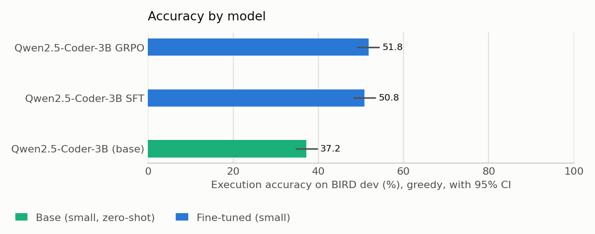
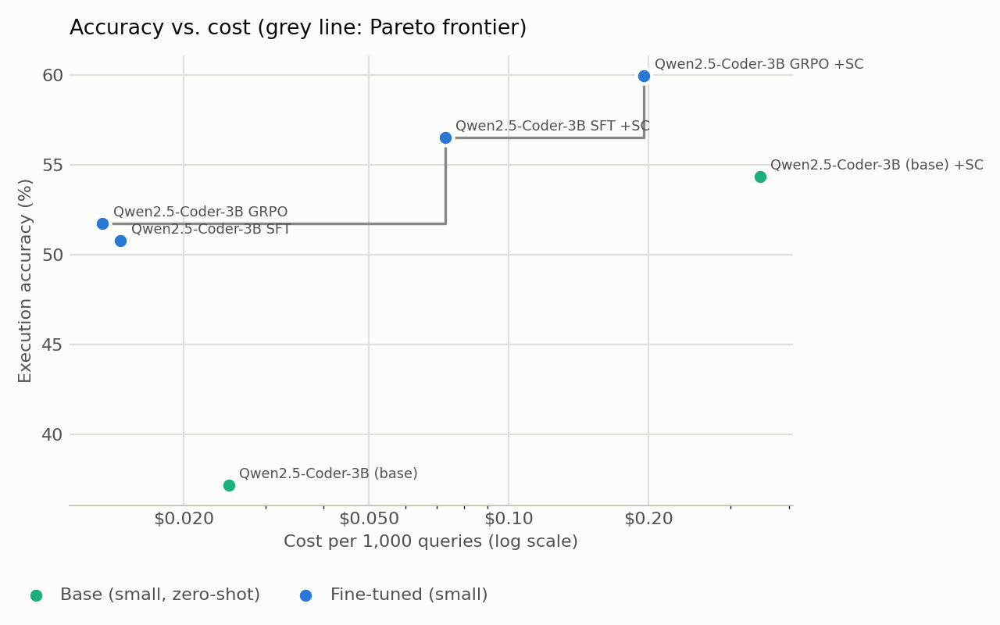
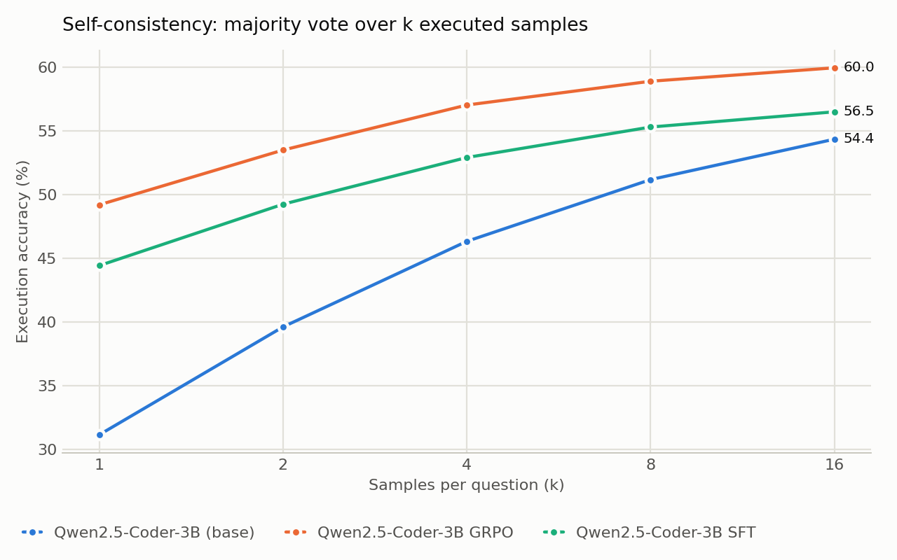
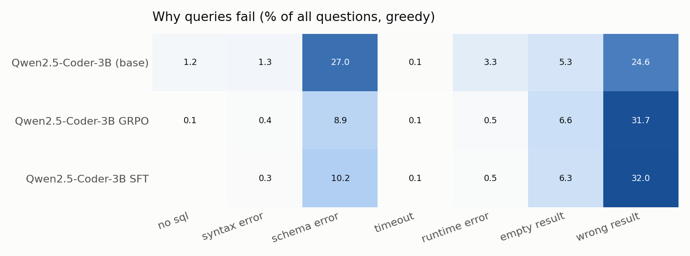

# Results

Benchmark: BIRD dev (1534 questions). EX is execution accuracy: the share of questions where the predicted query returns the same set of rows as the gold query. Every model sees the same prompt.

## Headline

| Model | Group | Params | Training | EX % (95% CI) | Simple | Moderate | Challenging | Soft-F1 | R-VES | EX % with SC |
|---|---|---:|---|---:|---:|---:|---:|---:|---:|---:|
| Qwen2.5-Coder-3B GRPO | fine-tuned | 3B | grpo | **51.8** (49.2–54.2) | 58.4 | 42.5 | 39.3 | 54.9 | – | 60.0 (n=16) |
| Qwen2.5-Coder-3B SFT | fine-tuned | 3B | sft | **50.8** (48.3–53.3) | 58.1 | 40.9 | 35.9 | 54.1 | – | 56.5 (n=16) |
| Qwen2.5-Coder-3B (base) | base | 3B | none | **37.2** (34.7–39.6) | 44.4 | 26.9 | 23.4 | 39.9 | – | 54.4 (n=16) |

## Is the difference real?

Paired on identical questions. Δ is fine-tuned minus frontier, with a paired-bootstrap 95% CI. McNemar's exact test uses only the questions where exactly one model is right; Holm-adjusted p-values correct for testing several pairs at once.

No fine-tuned vs frontier pairs in this report.

## Test-time compute: self-consistency

maj@k: accuracy when k sampled queries vote by execution result. pass@k: share of questions where at least one of k samples is correct (an upper bound for any reranker).

| Model | maj@1 | maj@2 | maj@4 | maj@8 | maj@16 | pass@1 | pass@2 | pass@4 | pass@8 | pass@16 |
|---|---:|---:|---:|---:|---:|---:|---:|---:|---:|---:|
| Qwen2.5-Coder-3B (base) | 31.2 | 39.6 | 46.3 | 51.2 | 54.4 | 31.0 | 43.1 | 53.7 | 62.2 | 68.8 |
| Qwen2.5-Coder-3B GRPO | 49.2 | 53.5 | 57.1 | 58.9 | 60.0 | 49.1 | 58.5 | 65.4 | 70.6 | 74.7 |
| Qwen2.5-Coder-3B SFT | 44.4 | 49.3 | 52.9 | 55.3 | 56.5 | 44.5 | 54.7 | 62.7 | 68.9 | 73.9 |

## Why queries fail (greedy, % of questions)

| Model | correct | no sql | syntax error | schema error | timeout | runtime error | empty result | wrong result | Table recall | Column recall |
|---|---:|---:|---:|---:|---:|---:|---:|---:|---:|---:|
| Qwen2.5-Coder-3B (base) | 37.2 | 1.2 | 1.3 | 27.0 | 0.1 | 3.3 | 5.3 | 24.6 | 89.2 | 87.1 |
| Qwen2.5-Coder-3B GRPO | 51.8 | 0.1 | 0.4 | 8.9 | 0.1 | 0.5 | 6.6 | 31.7 | 92.8 | 88.5 |
| Qwen2.5-Coder-3B SFT | 50.8 | 0.0 | 0.3 | 10.2 | 0.1 | 0.5 | 6.3 | 32.0 | 92.7 | 91.4 |

## Cost and latency

API models are priced per token (prompt-cache reads included). Local models are priced by amortised GPU time per query at the hourly rate in their config.

| Model | Decoding | Input tok | Output tok | p50 latency | p95 latency | $ / 1k queries | $ / 1k correct answers |
|---|---|---:|---:|---:|---:|---:|---:|
| Qwen2.5-Coder-3B (base) | greedy | 2446.7 | 370.0 | 0.07s | 0.07s | $0.025 | $0.067 |
| Qwen2.5-Coder-3B (base) | SC@16 | 2446.7 | 4858.9 | 0.86s | 1.21s | $0.35 | $0.64 |
| Qwen2.5-Coder-3B GRPO | greedy | 2446.7 | 216.3 | 0.03s | 0.06s | $0.013 | $0.026 |
| Qwen2.5-Coder-3B GRPO | SC@16 | 2446.7 | 2780.8 | 0.49s | 0.68s | $0.20 | $0.33 |
| Qwen2.5-Coder-3B SFT | greedy | 2424.7 | 59.5 | 0.05s | 0.06s | $0.015 | $0.029 |
| Qwen2.5-Coder-3B SFT | SC@16 | 2424.7 | 920.5 | 0.17s | 0.27s | $0.073 | $0.13 |

## Figures

